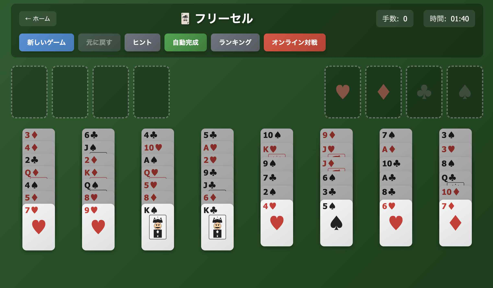
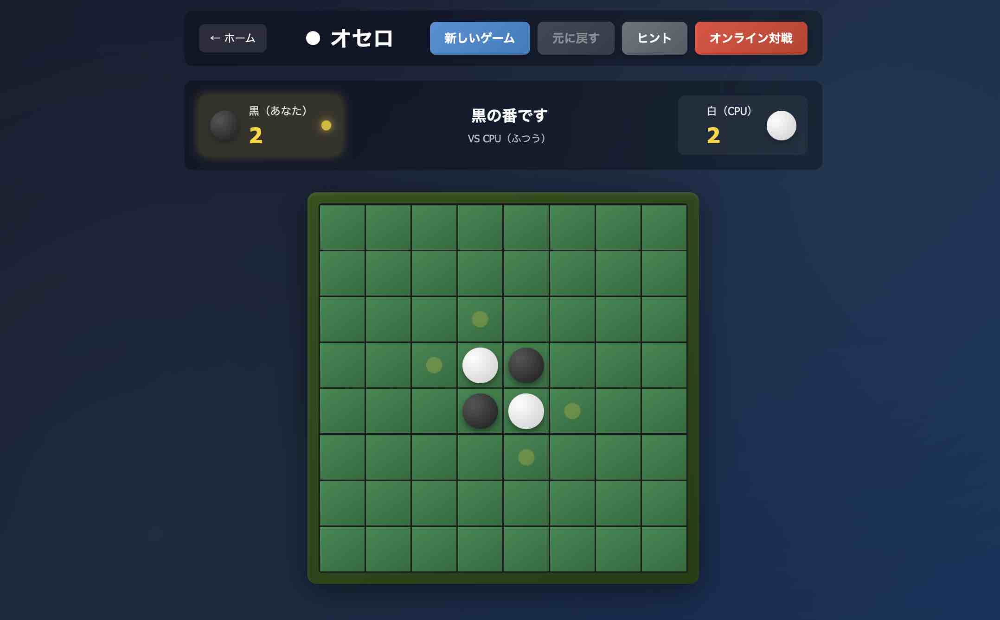

# 🎮 ボードゲーム コレクション

クラシックなボードゲームをオンラインで楽しめるWebアプリケーション集です。

## 🎯 プレイする

**[▶️ 今すぐプレイ](https://gotorius.github.io/boardgames/)**

## 📸 スクリーンショット

<p align="center">
  
  
</p>

## 🎲 ゲーム一覧

| ゲーム | 状態 | 機能 | 説明 |
|--------|------|------|------|
| 🃏 [フリーセル](./freecell/) | ✅ 公開中 | ランキング・オンライン対戦 | クラシックなトランプソリティア |
| ⚫ [オセロ](./othello/) | ✅ 公開中 | CPU対戦・オンライン対戦 | 白と黒の戦略ゲーム |
| ♟️ [将棋](./shogi/) | ✅ 公開中 | CPU対戦・オンライン対戦・詰将棋 | 日本の伝統的な戦略ゲーム |
| ♛ [チェス](./chess/) | ✅ 公開中 | CPU対戦・オンライン対戦 | 世界で愛される戦略ボードゲーム |
| ⭕ [五目並べ](./gomoku/) | ✅ 公開中 | CPU対戦・オンライン対戦 | シンプルで奥深い対戦ゲーム |
| 💣 [マインスイーパー](./minesweeper/) | ✅ 公開中 | ランキング・オンライン対戦 | 論理パズルゲーム |

## ✨ 特徴

- 🎮 **6種類のクラシックゲーム** - 懐かしのゲームをブラウザで
- 🤖 **CPU対戦** - 3段階の難易度（よわい・ふつう・つよい）
- 🌐 **オンライン対戦** - 世界中のプレイヤーとリアルタイム対戦
- 🏆 **ランキングシステム** - 最速クリアタイムを競おう
- 📱 **レスポンシブデザイン** - PC・タブレット・スマホ対応
- 🌙 **美しいUI** - ダークテーマでモダンなデザイン

## 🛠️ 技術スタック

- HTML5
- CSS3
- JavaScript (Vanilla)
- Firebase (Firestore - ランキング・オンライン対戦)

## 📁 ディレクトリ構成

```
boardgames/
├── index.html          # ホーム画面
├── styles.css          # 共通スタイル
├── images/             # スクリーンショット
├── freecell/           # フリーセル
│   ├── index.html
│   ├── game.js
│   ├── styles.css
│   └── firebase-config.js
├── othello/            # オセロ
│   ├── index.html
│   ├── game.js
│   ├── styles.css
│   └── firebase-config.js
├── shogi/              # 将棋
│   ├── index.html
│   ├── game.js
│   ├── styles.css
│   └── firebase-config.js
├── chess/              # チェス
│   ├── index.html
│   ├── game.js
│   ├── styles.css
│   └── firebase-config.js
├── gomoku/             # 五目並べ
│   ├── index.html
│   ├── game.js
│   ├── styles.css
│   └── firebase-config.js
└── minesweeper/        # マインスイーパー
    ├── index.html
    ├── game.js
    ├── styles.css
    └── firebase-config.js
```

## 🚀 ローカルで実行

```bash
git clone https://github.com/gotorius/boardgames.git
cd boardgames
python3 -m http.server 8000
# ブラウザで http://localhost:8000 を開く
```

## 🤝 コントリビューション

Issue や Pull Request は歓迎します！

## 📄 ライセンス

MIT License
